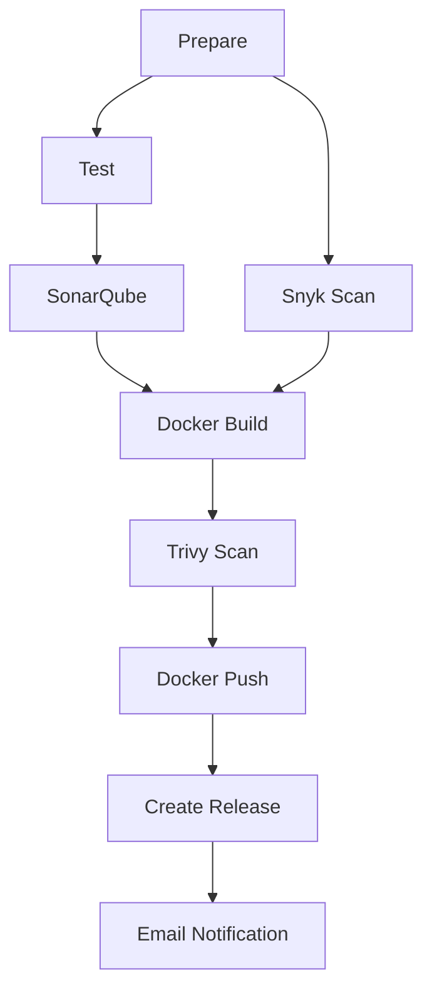

# NutriAI — Reusable Workflows Repository

This repository contains the shared, reusable **GitHub Actions** workflow templates used by all backend Python microservices inside the NutriAI application. Standardizing CI/CD pipelines as centralized reusable actions ensures consistent security scanning, code quality checks, and deployment triggers across the entire platform.

---

## 📂 Reusable Workflows Inventory

The repository contains two core workflow files under `.github/workflows/`:

### 1. `ci.yml` (Continuous Integration)
A standard, end-to-end Python microservice validation pipeline. It runs unit tests, scans for bugs/code quality issues, runs dependency vulnerability checks, builds/scans the container image, pushes to Azure Container Registry (ACR), drafts GitHub releases, and notifies developers via email.

#### ⚙️ Input Parameters
| Input Name | Required | Type | Default | Description |
| :--- | :--- | :--- | :--- | :--- |
| `service-name` | **Yes** | string | — | Docker container image tag name (e.g., `nutriai-auth-service`). |
| `sonar_project_key` | **Yes** | string | — | Project identifier used in SonarQube dashboard. |
| `python_version` | No | string | `3.12` | Python version to configure on runner. |

#### 🔑 Required Secrets
| Secret Key Name | Purpose |
| :--- | :--- |
| `SONAR_TOKEN` | Token to authenticate scans with the SonarQube server. |
| `SONAR_HOST_URL` | Public/internal address of the SonarQube console. |
| `SNYK_TOKEN` | Authentication token to run Snyk CLI vulnerability tests. |
| `ACR_LOGIN_SERVER` | Address of target Azure Container Registry (e.g. `*.azurecr.io`). |
| `ACR_USERNAME` | ACR registry service principal or admin username. |
| `ACR_PASSWORD` | ACR registry credential password. |
| `SMTP_HOST` / `SMTP_PORT` | SMTP relay server config (for alert emails). |
| `SMTP_USERNAME` / `SMTP_PASSWORD` | SMTP authentication credentials. |
| `EMAIL_TO` | Target recipient email address for build status reports. |

#### 🎯 Workflow Outputs
* `tag`: The resolved version tag (e.g., `v1.2.3` or `dev-abcdefg`).
* `push`: Boolean indicating whether the image was pushed to ACR.

#### 🔄 Pipeline Job Steps Sequence

1. **Prepare**: Checks out codebase. Configures Python environment. Caches pip dependencies. Calculates semantic tags using standard git tag actions (prefixing `v` on main branch, `dev-{commit_sha}` on dev branch).
2. **Test**: Restores caches. Installs testing dependencies (`pytest`, `pytest-cov`, `httpx`, `pytest-asyncio`). Runs Pytest and generates coverage report `coverage.xml`.
3. **SonarQube**: Downloads coverage outputs. Conducts analysis and asserts Quality Gate pass conditions.
4. **Snyk Security**: Installs `snyk-to-html`. Evaluates `requirements.txt` dependencies for high/critical security flaws and generates an HTML report artifact.
5. **Docker Build**: Packages code using local `Dockerfile`. Exports image as a tar archive.
6. **Trivy Image Scan**: Downloads built Docker image. Audits container OS and packages. Fails build if unfixed `HIGH` or `CRITICAL` vulnerability concerns are discovered.
7. **Docker Push**: Authenticates with ACR login server. Pushes the tag. Tags image as `latest` on pushes to the `main` branch. Creates Git release tag.
8. **Create GitHub Release**: Automatically compiles commits and drafts a GitHub release description.
9. **Notify**: Sends SMTP formatted emails to `EMAIL_TO` detailing success or failure.

---

### 2. `helm-updater.yml` (Continuous Delivery)
An automated configuration manager that updates Helm values files in the manifests repository on successful code updates.

#### ⚙️ Input Parameters
| Input Name | Required | Type | Description |
| :--- | :--- | :--- | :--- |
| `helm-service-name`| **Yes** | string | Service name key matching values block inside `values-{env}.yaml`. |
| `chart-path` | **Yes** | string | Path to Helm chart templates directory (e.g., `helm/nutriai`). |
| `image-tag` | **Yes** | string | Dynamic container version tag to apply. |

#### 🔑 Required Secrets
| Secret Key Name | Purpose |
| :--- | :--- |
| `APP_ID` | GitHub App ID registered with manifest repository to allow cross-repo pushes. |
| `APP_PRIVATE_KEY` | Private PEM key of the GitHub App. |
| `MANIFEST_REPO` | Name of the manifest repository (e.g., `NutriAI-manifests`). |

#### 🔄 Pipeline Job Steps Sequence
1. **Resolve Target**: Resolves target values config based on active branch triggers (`values-prod.yaml` for `main` branch, `values-dev.yaml` for `dev` branch).
2. **Authenticate App**: Obtains a secure temporary GitHub Installation token from the GitHub App credentials.
3. **Checkout Manifests**: Checks out the manifests repository using the token.
4. **Update Image Tag**: Executes `yq` to update the image tag of the microservice (e.g. `."admin-service".image.tag = "tag"`).
5. **Commit & Push**: Commits the configuration file change. Employs a retry loop (retries up to 5 times with `git pull --rebase` logic) to prevent concurrent build write conflicts in the manifest repository.

---

## 🔗 How Services Reference Reusable Workflows

Backend services reference these pipelines in their workflow configs (e.g. `cicd.yml`):
```yaml
jobs:
  ci:
    uses: NutriAI16-ORG/NutriAI-reusable-workflows/.github/workflows/ci.yml@main
    with:
      service-name: nutriai-admin-service
      sonar_project_key: NutriAI-Admin-Service
    secrets:
      SONAR_TOKEN: ${{ secrets.SONAR_TOKEN }}
      # (pass other secrets...)
```
